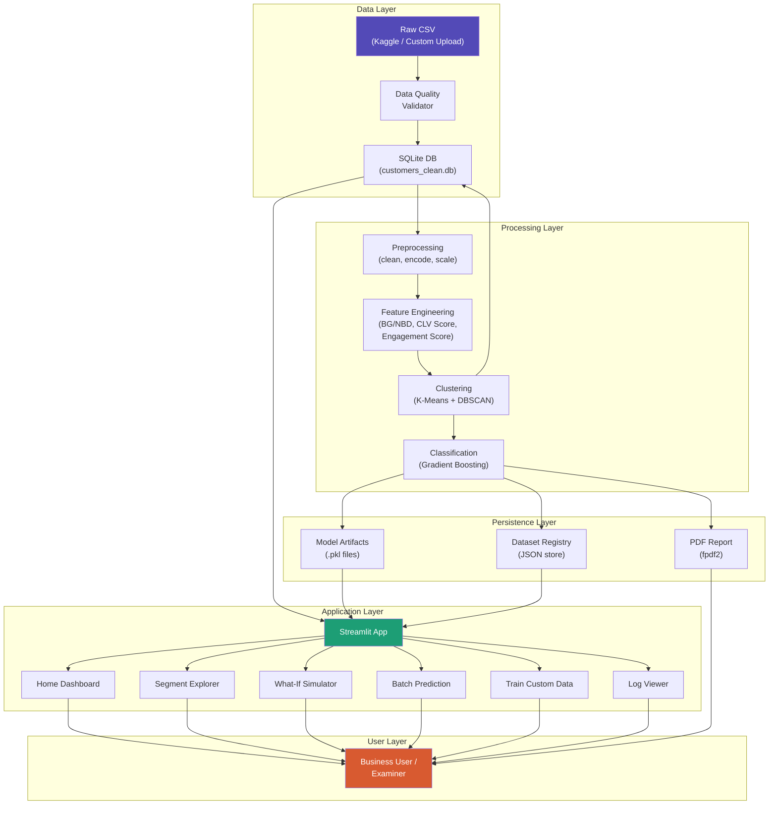
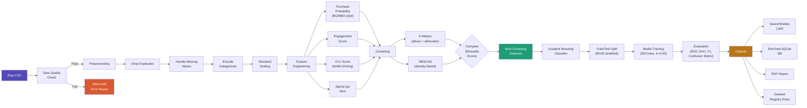

# CLV Micro-Segmentation — E-Commerce Customer Analysis

> Final Year Data Science Project · 2026  
> **Stack:** Python · Pandas · Scikit-learn · Streamlit · Plotly · SQLite · SHAP · FPDF2

---

## What This Project Does

An end-to-end Data Science pipeline that:
1. **Segments** e-commerce customers using K-Means and DBSCAN.
2. **Predicts** each customer's CLV band (Low / Medium / High) using Gradient Boosting.
3. **Validates** data quality before training to ensure robustness.
4. **Logs** operations comprehensively to terminal and file.
5. **Generates** professional multi-page PDF reports detailing EDA, segmentation metrics, classifier performance, and tailored business recommendations.
6. **Deploys** as an interactive Streamlit web app with 5 pages and a persistent dataset registry to switch between runs.

---

## Project Structure

```
clv-segmentation/
├── app.py                        # Streamlit home page & dashboard
├── train_pipeline.py             # One-shot default training script
├── requirements.txt              # Project dependencies
├── improvement.md                # Development improvement checklist
├── data/
│   ├── raw/                      # Put Kaggle CSV and custom test CSVs here
│   └── processed/                # SQLite DB and dataset registry (auto-created)
│       ├── dataset_registry.json # Registry metadata for all runs
│       └── datasets/             # Directory storing models/data for each run
├── src/
│   ├── preprocess.py             # Clean, encode, scale
│   ├── features.py               # BG/NBD score + CLV features
│   ├── cluster.py                # DBSCAN + K-Means models
│   ├── model.py                  # Gradient Boosting classifier
│   ├── evaluate.py               # All evaluation metrics
│   ├── dataset_store.py          # Persistent dataset registry logic
│   ├── data_quality.py           # Pre-training schema validation
│   ├── logger.py                 # Structured color logging setup
│   └── report.py                 # Professional PDF report generator
├── models/                       # Saved live .pkl artifacts (auto-created)
├── reports/                      # Generated PDF reports (auto-created)
├── logs/                         # File logging target (pipeline.log)
└── pages/
    ├── 1_segment_explorer.py     # Filterable customer segment dashboard
    ├── 2_whatif_simulator.py     # Single customer prediction simulator
    ├── 3_batch_upload.py         # Bulk predictions and model evaluation
    ├── 4_train_custom.py         # Custom dataset training interface
    └── 5_log_viewer.py           # Structured log exploration interface
```

---

## Setup Guide

### Step 1 — Clone / Download the project

```bash
git clone https://github.com/YOUR_USERNAME/clv-segmentation.git
cd clv-segmentation
```

### Step 2 — Create a virtual environment

```bash
python -m venv venv

# Activate (Mac/Linux)
source venv/bin/activate

# Activate (Windows)
venv\Scripts\activate
```

### Step 3 — Install dependencies

```bash
pip install -r requirements.txt
```

### Step 4 — Download the Kaggle dataset

1. Go to: https://www.kaggle.com/datasets/uom190346a/e-commerce-customer-behavior-dataset
2. Download `E Commerce Customer Behavior - Sheet1.csv`
3. Rename it to `ecommerce_customer_data.csv`
4. Place it in `data/raw/`

### Step 5 — Run the training pipeline

```bash
python train_pipeline.py
```

This will:
- Run pre-training data quality checks
- Clean and preprocess the data
- Engineer CLV features (BG/NBD score, engagement, spend per item)
- Run K-Means + DBSCAN clustering
- Train the Gradient Boosting CLV classifier
- Save all model artifacts to `models/`
- Save enriched data to `data/processed/customers_clean.db`
- Register the dataset to the registry
- Generate a professional PDF report in `reports/`

### Step 6 — Launch the Streamlit app

```bash
streamlit run app.py
```

Open http://localhost:8501 in your browser.

---

## App Pages

| Page | Description |
|------|-------------|
| Home | KPI overview; active dataset switcher; segment + CLV charts |
| Segment Explorer | Filter by segment / CLV band / membership; EDA; heatmap |
| What-If Simulator | Sliders → live CLV band prediction + confidence + action |
| Batch Prediction | Upload CSV → bulk predictions + evaluation report |
| Train on Your Data | Upload CSV → live pipeline → PDF report → dataset history |
| Log Viewer | Per-run filterable log with severity badges + keyword search |

---

## High-Level Design (HLD)



---

## ML Pipeline Flow



---

## ML Pipeline Summary

| Component | Detail |
|-----------|--------|
| Dataset | Kaggle E-Commerce Customer Behavior (~350 features) |
| Storage | SQLite via `sqlite3` (standard library) |
| Clustering | K-Means (elbow + silhouette), DBSCAN; best model selected automatically |
| CLV Feature | Manual BG/NBD-style purchase probability + engagement score |
| Classifier | `GradientBoostingClassifier` (200 estimators, lr=0.05) |
| Target | CLV Band: Low / Medium / High (tertile binning) |
| Evaluation | Silhouette, Davies-Bouldin, F1, ROC-AUC, Confusion Matrix, SHAP |
| PDF Report | fpdf2 — live charts generated per dataset, not static PNGs |
| Data Quality | Pre-training validation: missing values, dtypes, outliers |
| Dataset Registry | JSON registry — switch between any previously trained dataset |
| Logging | colorlog terminal + rotating file handler (logs/pipeline.log) |
| Deployment | Streamlit Community Cloud (free) |

---

## Deployment

See [deployment.md](deployment.md) for detailed step-by-step guides to deploy this app
for free on **Streamlit Community Cloud**, **Render**, **Hugging Face Spaces**, or **Railway**.

---

## Test Datasets

Three CSVs are provided for testing edge cases:
- `test_worst_case.csv`        — 1030 rows, 15% missing, bad dtypes, duplicates, Unicode
- `test_high_value_skewed.csv` — 1000 rows, 70% Gold members, imbalanced CLV bands
- `test_churned_atrisk.csv`    — 1000 rows, 60% Bronze/churned, 3 extra unknown columns

---

## Dataset Citation

E-Commerce Customer Behavior Dataset  
https://www.kaggle.com/datasets/uom190346a/e-commerce-customer-behavior-dataset

